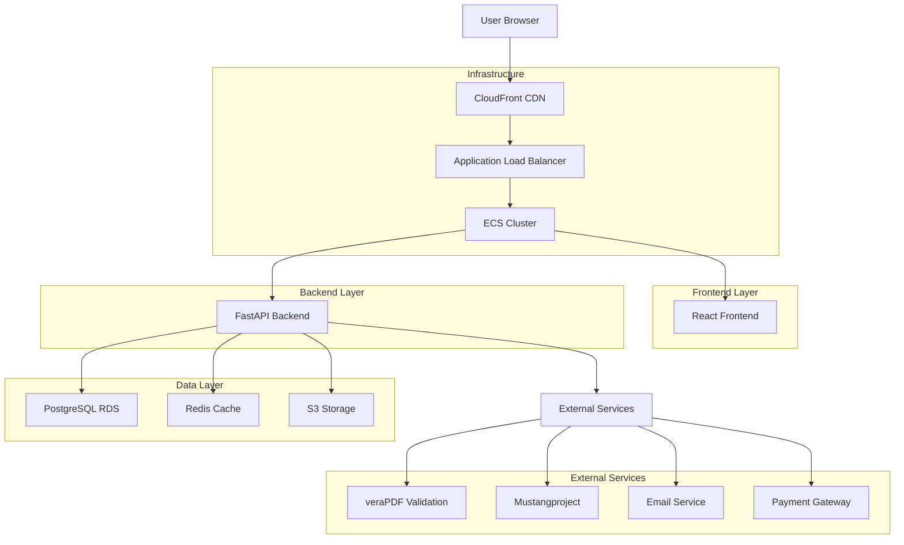
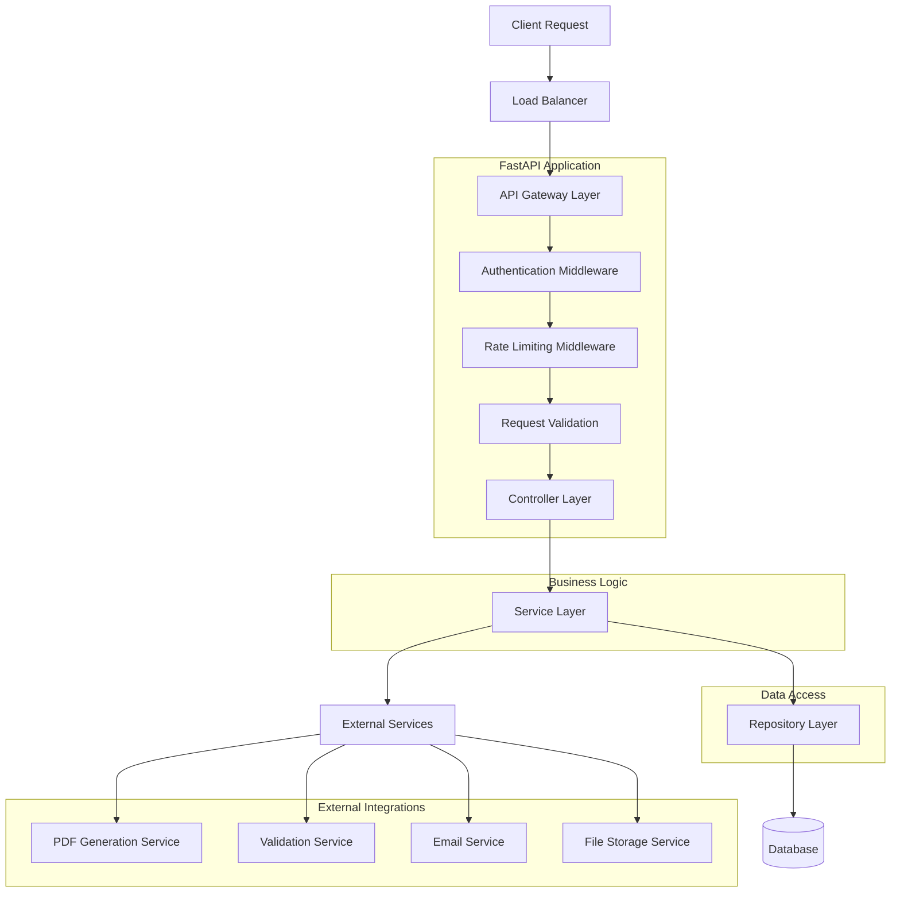
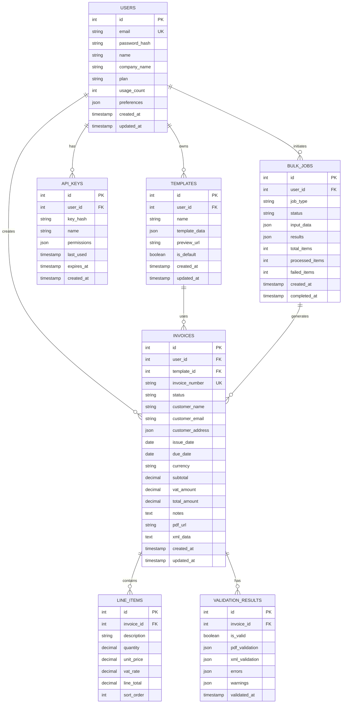

# Technical Architecture Document

## 1. Architecture Design



## 2. Technology Description

### Core Technology Stack
- **Backend**: Python 3.11 + FastAPI + SQLAlchemy + Alembic
- **Frontend**: React 18 + TypeScript + Tailwind CSS + Vite
- **Database**: PostgreSQL 15 with JSON support
- **Cache**: Redis 7 for sessions and application cache
- **Package Management**: uv (Python), npm (Node.js)
- **Containerization**: Docker with multi-stage builds
- **Orchestration**: AWS ECS with Fargate

### Factur-X Specific Libraries
- **PDF Generation**: WeasyPrint (PDF/A-3 compliant)
- **XML Generation**: factur-x library (EN 16931 compliant)
- **PDF Validation**: veraPDF (industry standard)
- **XML Validation**: Mustangproject (EN 16931 validator)
- **File Processing**: PyPDF2, lxml for XML manipulation

### Infrastructure & DevOps
- **Cloud Provider**: AWS (eu-west-1 region)
- **CDN**: CloudFront for global content delivery
- **Load Balancer**: Application Load Balancer (ALB)
- **Storage**: S3 with lifecycle management
- **Monitoring**: CloudWatch + Prometheus + Grafana
- **Logging**: Structured logging with Sentry
- **CI/CD**: GitHub Actions with OIDC authentication

## 3. Route Definitions

### Frontend Routes
| Route | Purpose | Authentication |
|-------|---------|----------------|
| `/` | Landing page and marketing | Public |
| `/login` | User authentication | Public |
| `/register` | User registration | Public |
| `/dashboard` | Main user dashboard | Required |
| `/invoices` | Invoice management | Required |
| `/invoices/new` | Create new invoice | Required |
| `/invoices/:id` | View/edit specific invoice | Required |
| `/invoices/:id/preview` | Invoice preview | Required |
| `/templates` | Template management | Required |
| `/settings` | User settings and preferences | Required |
| `/billing` | Subscription and billing | Required |
| `/api-docs` | API documentation | Public |

### Backend API Routes
| Route | Method | Purpose | Authentication |
|-------|--------|---------|----------------|
| `/health` | GET | Health check endpoint | None |
| `/api/auth/register` | POST | User registration | None |
| `/api/auth/login` | POST | User authentication | None |
| `/api/auth/refresh` | POST | Token refresh | Refresh Token |
| `/api/auth/logout` | POST | User logout | JWT |
| `/api/users/me` | GET | Current user profile | JWT |
| `/api/users/me` | PUT | Update user profile | JWT |
| `/api/invoices` | GET | List user invoices | JWT |
| `/api/invoices` | POST | Create new invoice | JWT |
| `/api/invoices/{id}` | GET | Get specific invoice | JWT |
| `/api/invoices/{id}` | PUT | Update invoice | JWT |
| `/api/invoices/{id}` | DELETE | Delete invoice | JWT |
| `/api/invoices/{id}/generate` | POST | Generate PDF | JWT |
| `/api/invoices/{id}/validate` | POST | Validate compliance | JWT |
| `/api/invoices/{id}/download` | GET | Download PDF | JWT |
| `/api/templates` | GET | List templates | JWT |
| `/api/templates` | POST | Create template | JWT |
| `/api/bulk/upload` | POST | Bulk invoice upload | JWT |
| `/api/bulk/{job_id}/status` | GET | Bulk job status | JWT |

## 4. API Definitions

### 4.1 Core API Endpoints

#### User Authentication
```
POST /api/auth/login
```

**Request:**
| Param Name | Param Type | isRequired | Description |
|------------|------------|------------|-------------|
| email | string | true | User email address |
| password | string | true | User password (plain text) |

**Response:**
| Param Name | Param Type | Description |
|------------|------------|-------------|
| access_token | string | JWT access token |
| refresh_token | string | JWT refresh token |
| token_type | string | Token type ("bearer") |
| expires_in | integer | Token expiration in seconds |

**Example Request:**
```json
{
  "email": "user@example.com",
  "password": "securepassword123"
}
```

**Example Response:**
```json
{
  "access_token": "eyJhbGciOiJIUzI1NiIsInR5cCI6IkpXVCJ9...",
  "refresh_token": "eyJhbGciOiJIUzI1NiIsInR5cCI6IkpXVCJ9...",
  "token_type": "bearer",
  "expires_in": 3600
}
```

#### Invoice Creation
```
POST /api/invoices
```

**Request:**
| Param Name | Param Type | isRequired | Description |
|------------|------------|------------|-------------|
| customer_name | string | true | Customer name |
| customer_email | string | false | Customer email |
| customer_address | object | true | Customer address details |
| invoice_number | string | false | Custom invoice number (auto-generated if not provided) |
| issue_date | string | true | Invoice issue date (ISO 8601) |
| due_date | string | true | Payment due date (ISO 8601) |
| currency | string | true | Currency code (EUR, USD, etc.) |
| line_items | array | true | Array of invoice line items |
| notes | string | false | Additional notes |
| template_id | integer | false | Template ID to use |

**Response:**
| Param Name | Param Type | Description |
|------------|------------|-------------|
| id | integer | Invoice ID |
| invoice_number | string | Generated invoice number |
| status | string | Invoice status |
| created_at | string | Creation timestamp |
| pdf_url | string | URL to generated PDF (if available) |

**Example Request:**
```json
{
  "customer_name": "Acme Corporation",
  "customer_email": "billing@acme.com",
  "customer_address": {
    "street": "123 Business Ave",
    "city": "Paris",
    "postal_code": "75001",
    "country": "FR"
  },
  "issue_date": "2024-01-15",
  "due_date": "2024-02-15",
  "currency": "EUR",
  "line_items": [
    {
      "description": "Consulting Services",
      "quantity": 10,
      "unit_price": 150.00,
      "vat_rate": 20.0
    }
  ],
  "notes": "Payment terms: 30 days"
}
```

#### Invoice Validation
```
POST /api/invoices/{id}/validate
```

**Response:**
| Param Name | Param Type | Description |
|------------|------------|-------------|
| is_valid | boolean | Overall validation status |
| pdf_validation | object | PDF/A-3 validation results |
| xml_validation | object | EN 16931 validation results |
| errors | array | List of validation errors |
| warnings | array | List of validation warnings |

**Example Response:**
```json
{
  "is_valid": true,
  "pdf_validation": {
    "is_pdfa3_compliant": true,
    "validator": "veraPDF",
    "version": "1.24.1"
  },
  "xml_validation": {
    "is_en16931_compliant": true,
    "validator": "Mustangproject",
    "version": "2.12.0"
  },
  "errors": [],
  "warnings": []
}
```

### 4.2 Data Models

#### User Model
```typescript
interface User {
  id: number;
  email: string;
  name: string;
  company_name?: string;
  plan: 'free' | 'starter' | 'professional' | 'business';
  usage_count: number;
  created_at: string;
  updated_at: string;
}
```

#### Invoice Model
```typescript
interface Invoice {
  id: number;
  user_id: number;
  invoice_number: string;
  status: 'draft' | 'generated' | 'sent' | 'paid';
  customer_name: string;
  customer_email?: string;
  customer_address: Address;
  issue_date: string;
  due_date: string;
  currency: string;
  subtotal: number;
  vat_amount: number;
  total_amount: number;
  line_items: LineItem[];
  notes?: string;
  pdf_url?: string;
  xml_data?: string;
  validation_status?: ValidationResult;
  created_at: string;
  updated_at: string;
}
```

#### Line Item Model
```typescript
interface LineItem {
  id: number;
  description: string;
  quantity: number;
  unit_price: number;
  vat_rate: number;
  line_total: number;
}
```

## 5. Server Architecture Diagram



### Layer Responsibilities

1. **API Gateway Layer**: Request routing, CORS handling, OpenAPI documentation
2. **Authentication Middleware**: JWT token validation, user context injection
3. **Rate Limiting Middleware**: API usage throttling, abuse prevention
4. **Request Validation**: Input sanitization, schema validation
5. **Controller Layer**: HTTP request/response handling, error formatting
6. **Service Layer**: Business logic, transaction management, orchestration
7. **Repository Layer**: Data access abstraction, query optimization
8. **External Services**: Third-party integrations, file operations

## 6. Data Model

### 6.1 Entity Relationship Diagram



### 6.2 Data Definition Language

#### Users Table
```sql
-- Create users table
CREATE TABLE users (
    id SERIAL PRIMARY KEY,
    email VARCHAR(255) UNIQUE NOT NULL,
    password_hash VARCHAR(255) NOT NULL,
    name VARCHAR(100) NOT NULL,
    company_name VARCHAR(200),
    plan VARCHAR(20) DEFAULT 'free' CHECK (plan IN ('free', 'starter', 'professional', 'business')),
    usage_count INTEGER DEFAULT 0,
    preferences JSONB DEFAULT '{}',
    created_at TIMESTAMP WITH TIME ZONE DEFAULT NOW(),
    updated_at TIMESTAMP WITH TIME ZONE DEFAULT NOW()
);

-- Create indexes
CREATE INDEX idx_users_email ON users(email);
CREATE INDEX idx_users_plan ON users(plan);
CREATE INDEX idx_users_created_at ON users(created_at DESC);
```

#### Invoices Table
```sql
-- Create invoices table
CREATE TABLE invoices (
    id SERIAL PRIMARY KEY,
    user_id INTEGER NOT NULL REFERENCES users(id) ON DELETE CASCADE,
    template_id INTEGER REFERENCES templates(id) ON DELETE SET NULL,
    invoice_number VARCHAR(50) UNIQUE NOT NULL,
    status VARCHAR(20) DEFAULT 'draft' CHECK (status IN ('draft', 'generated', 'sent', 'paid')),
    customer_name VARCHAR(200) NOT NULL,
    customer_email VARCHAR(255),
    customer_address JSONB NOT NULL,
    issue_date DATE NOT NULL,
    due_date DATE NOT NULL,
    currency CHAR(3) DEFAULT 'EUR',
    subtotal DECIMAL(10,2) NOT NULL,
    vat_amount DECIMAL(10,2) NOT NULL,
    total_amount DECIMAL(10,2) NOT NULL,
    notes TEXT,
    pdf_url VARCHAR(500),
    xml_data TEXT,
    created_at TIMESTAMP WITH TIME ZONE DEFAULT NOW(),
    updated_at TIMESTAMP WITH TIME ZONE DEFAULT NOW()
);

-- Create indexes
CREATE INDEX idx_invoices_user_id ON invoices(user_id);
CREATE INDEX idx_invoices_status ON invoices(status);
CREATE INDEX idx_invoices_invoice_number ON invoices(invoice_number);
CREATE INDEX idx_invoices_user_created ON invoices(user_id, created_at DESC);
CREATE INDEX idx_invoices_issue_date ON invoices(issue_date DESC);
```

#### Line Items Table
```sql
-- Create line_items table
CREATE TABLE line_items (
    id SERIAL PRIMARY KEY,
    invoice_id INTEGER NOT NULL REFERENCES invoices(id) ON DELETE CASCADE,
    description VARCHAR(500) NOT NULL,
    quantity DECIMAL(10,3) NOT NULL,
    unit_price DECIMAL(10,2) NOT NULL,
    vat_rate DECIMAL(5,2) NOT NULL,
    line_total DECIMAL(10,2) NOT NULL,
    sort_order INTEGER DEFAULT 0
);

-- Create indexes
CREATE INDEX idx_line_items_invoice_id ON line_items(invoice_id);
CREATE INDEX idx_line_items_sort_order ON line_items(invoice_id, sort_order);
```

#### Templates Table
```sql
-- Create templates table
CREATE TABLE templates (
    id SERIAL PRIMARY KEY,
    user_id INTEGER NOT NULL REFERENCES users(id) ON DELETE CASCADE,
    name VARCHAR(100) NOT NULL,
    template_data JSONB NOT NULL,
    preview_url VARCHAR(500),
    is_default BOOLEAN DEFAULT FALSE,
    created_at TIMESTAMP WITH TIME ZONE DEFAULT NOW(),
    updated_at TIMESTAMP WITH TIME ZONE DEFAULT NOW()
);

-- Create indexes
CREATE INDEX idx_templates_user_id ON templates(user_id);
CREATE INDEX idx_templates_is_default ON templates(user_id, is_default);
```

#### Validation Results Table
```sql
-- Create validation_results table
CREATE TABLE validation_results (
    id SERIAL PRIMARY KEY,
    invoice_id INTEGER NOT NULL REFERENCES invoices(id) ON DELETE CASCADE,
    is_valid BOOLEAN NOT NULL,
    pdf_validation JSONB,
    xml_validation JSONB,
    errors JSONB DEFAULT '[]',
    warnings JSONB DEFAULT '[]',
    validated_at TIMESTAMP WITH TIME ZONE DEFAULT NOW()
);

-- Create indexes
CREATE INDEX idx_validation_results_invoice_id ON validation_results(invoice_id);
CREATE INDEX idx_validation_results_is_valid ON validation_results(is_valid);
CREATE INDEX idx_validation_results_validated_at ON validation_results(validated_at DESC);
```

#### API Keys Table
```sql
-- Create api_keys table
CREATE TABLE api_keys (
    id SERIAL PRIMARY KEY,
    user_id INTEGER NOT NULL REFERENCES users(id) ON DELETE CASCADE,
    key_hash VARCHAR(255) NOT NULL,
    name VARCHAR(100) NOT NULL,
    permissions JSONB DEFAULT '{}',
    last_used TIMESTAMP WITH TIME ZONE,
    expires_at TIMESTAMP WITH TIME ZONE,
    created_at TIMESTAMP WITH TIME ZONE DEFAULT NOW()
);

-- Create indexes
CREATE INDEX idx_api_keys_user_id ON api_keys(user_id);
CREATE INDEX idx_api_keys_key_hash ON api_keys(key_hash);
CREATE INDEX idx_api_keys_expires_at ON api_keys(expires_at);
```

#### Bulk Jobs Table
```sql
-- Create bulk_jobs table
CREATE TABLE bulk_jobs (
    id SERIAL PRIMARY KEY,
    user_id INTEGER NOT NULL REFERENCES users(id) ON DELETE CASCADE,
    job_type VARCHAR(50) NOT NULL,
    status VARCHAR(20) DEFAULT 'pending' CHECK (status IN ('pending', 'processing', 'completed', 'failed')),
    input_data JSONB,
    results JSONB,
    total_items INTEGER DEFAULT 0,
    processed_items INTEGER DEFAULT 0,
    failed_items INTEGER DEFAULT 0,
    created_at TIMESTAMP WITH TIME ZONE DEFAULT NOW(),
    completed_at TIMESTAMP WITH TIME ZONE
);

-- Create indexes
CREATE INDEX idx_bulk_jobs_user_id ON bulk_jobs(user_id);
CREATE INDEX idx_bulk_jobs_status ON bulk_jobs(status);
CREATE INDEX idx_bulk_jobs_created_at ON bulk_jobs(created_at DESC);
```

#### Initial Data
```sql
-- Insert default template
INSERT INTO templates (user_id, name, template_data, is_default) VALUES
(1, 'Default Professional', '{
  "layout": "standard",
  "colors": {
    "primary": "#2563eb",
    "secondary": "#64748b"
  },
  "fonts": {
    "primary": "Inter",
    "secondary": "Inter"
  },
  "logo": null,
  "footer": "Thank you for your business!"
}', true);

-- Insert sample user (for development)
INSERT INTO users (email, password_hash, name, company_name, plan) VALUES
('demo@facturx-express.com', '$2b$12$LQv3c1yqBWVHxkd0LHAkCOYz6TtxMQJqhN8/LewdBPj6hsxq5S/kS', 'Demo User', 'Demo Company', 'professional');
```

---

**Document Owner:** Technical Architecture Team  
**Last Updated:** $(date)  
**Next Review:** Monthly during development, quarterly in production  
**Stakeholders:** CTO, Lead Developer, DevOps Engineer, Security Team