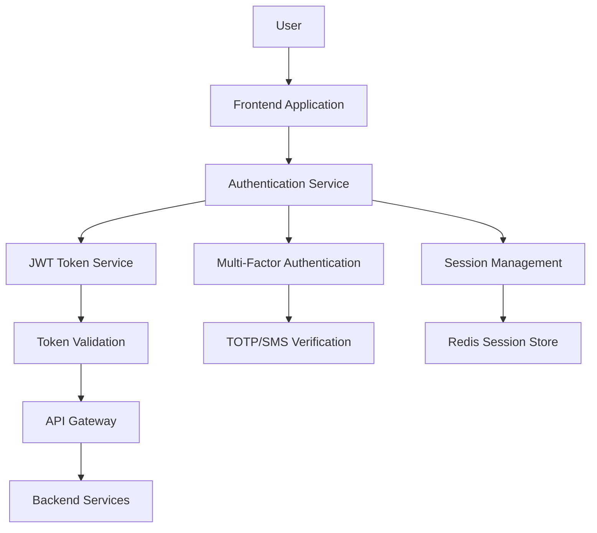

# Security Architecture

## Overview
This document outlines the comprehensive security architecture for Factur-X Express, covering authentication, authorization, data protection, threat modeling, and security monitoring.

---

## Table of Contents
1. [Security Principles](#security-principles)
2. [Authentication & Authorization](#authentication--authorization)
3. [Data Protection](#data-protection)
4. [API Security](#api-security)
5. [Infrastructure Security](#infrastructure-security)
6. [Threat Modeling](#threat-modeling)
7. [Security Monitoring](#security-monitoring)
8. [Incident Response](#incident-response)
9. [Compliance & Auditing](#compliance--auditing)

---

## Security Principles

### 1.1 Defense in Depth
- **Multiple Security Layers**: Network, application, data, and user layers
- **Fail-Safe Defaults**: Secure by default configurations
- **Least Privilege**: Minimum necessary access rights
- **Zero Trust**: Never trust, always verify

### 1.2 Security by Design
- **Threat Modeling**: Systematic identification of security threats
- **Secure Development**: Security integrated into SDLC
- **Privacy by Design**: Data protection built into system architecture
- **Continuous Security**: Ongoing security assessment and improvement

### 1.3 Compliance Requirements
- **GDPR**: Data protection and privacy
- **SOC 2 Type II**: Security, availability, and confidentiality
- **ISO 27001**: Information security management
- **French Data Protection**: CNIL compliance

---

## Authentication & Authorization

### 2.1 Authentication Architecture



### 2.2 JWT Implementation

```python
import jwt
import secrets
from datetime import datetime, timedelta
from cryptography.hazmat.primitives import serialization
from cryptography.hazmat.primitives.asymmetric import rsa

class JWTService:
    def __init__(self):
        self.algorithm = 'RS256'
        self.access_token_expire = timedelta(minutes=15)
        self.refresh_token_expire = timedelta(days=30)
        self.private_key = self._load_private_key()
        self.public_key = self._load_public_key()
    
    def generate_tokens(self, user_id: str, email: str, roles: list) -> dict:
        """
        Generate access and refresh tokens
        """
        now = datetime.utcnow()
        
        # Access token payload
        access_payload = {
            'sub': user_id,
            'email': email,
            'roles': roles,
            'type': 'access',
            'iat': now,
            'exp': now + self.access_token_expire,
            'jti': secrets.token_urlsafe(32)  # JWT ID for revocation
        }
        
        # Refresh token payload
        refresh_payload = {
            'sub': user_id,
            'type': 'refresh',
            'iat': now,
            'exp': now + self.refresh_token_expire,
            'jti': secrets.token_urlsafe(32)
        }
        
        access_token = jwt.encode(access_payload, self.private_key, algorithm=self.algorithm)
        refresh_token = jwt.encode(refresh_payload, self.private_key, algorithm=self.algorithm)
        
        # Store refresh token in Redis for revocation
        self._store_refresh_token(user_id, refresh_payload['jti'], refresh_payload['exp'])
        
        return {
            'access_token': access_token,
            'refresh_token': refresh_token,
            'token_type': 'Bearer',
            'expires_in': int(self.access_token_expire.total_seconds())
        }
    
    def verify_token(self, token: str) -> dict:
        """
        Verify and decode JWT token
        """
        try:
            payload = jwt.decode(token, self.public_key, algorithms=[self.algorithm])
            
            # Check if token is revoked
            if self._is_token_revoked(payload.get('jti')):
                raise jwt.InvalidTokenError("Token has been revoked")
            
            return payload
        except jwt.ExpiredSignatureError:
            raise jwt.InvalidTokenError("Token has expired")
        except jwt.InvalidTokenError as e:
            raise jwt.InvalidTokenError(f"Invalid token: {str(e)}")
    
    def refresh_access_token(self, refresh_token: str) -> dict:
        """
        Generate new access token using refresh token
        """
        try:
            payload = jwt.decode(refresh_token, self.public_key, algorithms=[self.algorithm])
            
            if payload.get('type') != 'refresh':
                raise jwt.InvalidTokenError("Invalid token type")
            
            # Verify refresh token is not revoked
            if self._is_token_revoked(payload.get('jti')):
                raise jwt.InvalidTokenError("Refresh token has been revoked")
            
            # Get user data
            user = get_user(payload['sub'])
            if not user or not user.is_active:
                raise jwt.InvalidTokenError("User not found or inactive")
            
            # Generate new access token
            return self.generate_tokens(user.id, user.email, user.roles)
            
        except jwt.ExpiredSignatureError:
            raise jwt.InvalidTokenError("Refresh token has expired")
        except jwt.InvalidTokenError as e:
            raise jwt.InvalidTokenError(f"Invalid refresh token: {str(e)}")
    
    def revoke_token(self, jti: str):
        """
        Revoke a token by adding its JTI to blacklist
        """
        redis_client.setex(f"revoked_token:{jti}", 86400 * 30, "revoked")
    
    def _is_token_revoked(self, jti: str) -> bool:
        """
        Check if token is revoked
        """
        return redis_client.exists(f"revoked_token:{jti}")
    
    def _store_refresh_token(self, user_id: str, jti: str, exp: datetime):
        """
        Store refresh token for tracking
        """
        ttl = int((exp - datetime.utcnow()).total_seconds())
        redis_client.setex(f"refresh_token:{user_id}:{jti}", ttl, "active")
```

### 2.3 Multi-Factor Authentication

```python
import pyotp
import qrcode
from io import BytesIO
import base64

class MFAService:
    def __init__(self):
        self.issuer_name = "Factur-X Express"
    
    def generate_secret(self, user_email: str) -> dict:
        """
        Generate TOTP secret for user
        """
        secret = pyotp.random_base32()
        
        # Create TOTP URI
        totp_uri = pyotp.totp.TOTP(secret).provisioning_uri(
            name=user_email,
            issuer_name=self.issuer_name
        )
        
        # Generate QR code
        qr_code = self._generate_qr_code(totp_uri)
        
        return {
            'secret': secret,
            'qr_code': qr_code,
            'backup_codes': self._generate_backup_codes()
        }
    
    def verify_totp(self, secret: str, token: str) -> bool:
        """
        Verify TOTP token
        """
        totp = pyotp.TOTP(secret)
        return totp.verify(token, valid_window=1)  # Allow 30-second window
    
    def verify_backup_code(self, user_id: str, code: str) -> bool:
        """
        Verify backup code and mark as used
        """
        backup_code = BackupCode.query.filter_by(
            user_id=user_id,
            code_hash=hash_backup_code(code),
            used=False
        ).first()
        
        if backup_code:
            backup_code.used = True
            backup_code.used_at = datetime.utcnow()
            db.session.commit()
            return True
        
        return False
    
    def _generate_qr_code(self, uri: str) -> str:
        """
        Generate QR code for TOTP setup
        """
        qr = qrcode.QRCode(version=1, box_size=10, border=5)
        qr.add_data(uri)
        qr.make(fit=True)
        
        img = qr.make_image(fill_color="black", back_color="white")
        buffer = BytesIO()
        img.save(buffer, format='PNG')
        
        return base64.b64encode(buffer.getvalue()).decode()
    
    def _generate_backup_codes(self) -> list:
        """
        Generate backup codes for account recovery
        """
        return [secrets.token_hex(4).upper() for _ in range(10)]
```

### 2.4 Role-Based Access Control (RBAC)

```python
from enum import Enum
from functools import wraps

class Permission(Enum):
    # Invoice permissions
    CREATE_INVOICE = "invoice:create"
    READ_INVOICE = "invoice:read"
    UPDATE_INVOICE = "invoice:update"
    DELETE_INVOICE = "invoice:delete"
    
    # Template permissions
    CREATE_TEMPLATE = "template:create"
    READ_TEMPLATE = "template:read"
    UPDATE_TEMPLATE = "template:update"
    DELETE_TEMPLATE = "template:delete"
    
    # API permissions
    USE_API = "api:use"
    MANAGE_API_KEYS = "api:manage_keys"
    
    # Admin permissions
    MANAGE_USERS = "admin:manage_users"
    VIEW_ANALYTICS = "admin:view_analytics"
    MANAGE_SYSTEM = "admin:manage_system"

class Role(Enum):
    FREE_USER = "free_user"
    PREMIUM_USER = "premium_user"
    ADMIN = "admin"
    SUPER_ADMIN = "super_admin"

# Role-Permission mapping
ROLE_PERMISSIONS = {
    Role.FREE_USER: [
        Permission.CREATE_INVOICE,
        Permission.READ_INVOICE,
        Permission.UPDATE_INVOICE,
        Permission.DELETE_INVOICE,
        Permission.READ_TEMPLATE,
    ],
    Role.PREMIUM_USER: [
        Permission.CREATE_INVOICE,
        Permission.READ_INVOICE,
        Permission.UPDATE_INVOICE,
        Permission.DELETE_INVOICE,
        Permission.CREATE_TEMPLATE,
        Permission.READ_TEMPLATE,
        Permission.UPDATE_TEMPLATE,
        Permission.DELETE_TEMPLATE,
        Permission.USE_API,
        Permission.MANAGE_API_KEYS,
    ],
    Role.ADMIN: [
        # All premium permissions plus admin permissions
        *ROLE_PERMISSIONS[Role.PREMIUM_USER],
        Permission.MANAGE_USERS,
        Permission.VIEW_ANALYTICS,
    ],
    Role.SUPER_ADMIN: [
        # All permissions
        *[perm for perm in Permission],
    ]
}

def require_permission(permission: Permission):
    """
    Decorator to require specific permission for endpoint access
    """
    def decorator(f):
        @wraps(f)
        def decorated_function(*args, **kwargs):
            # Get current user from JWT token
            current_user = get_current_user()
            
            if not current_user:
                return {'error': 'Authentication required'}, 401
            
            # Check if user has required permission
            if not has_permission(current_user, permission):
                return {'error': 'Insufficient permissions'}, 403
            
            return f(*args, **kwargs)
        return decorated_function
    return decorator

def has_permission(user, permission: Permission) -> bool:
    """
    Check if user has specific permission
    """
    user_roles = [Role(role) for role in user.roles]
    
    for role in user_roles:
        if permission in ROLE_PERMISSIONS.get(role, []):
            return True
    
    return False

# Usage example
@app.route('/api/invoices', methods=['POST'])
@require_permission(Permission.CREATE_INVOICE)
def create_invoice():
    # Invoice creation logic
    pass
```

---

## Data Protection

### 3.1 Encryption Strategy

#### Encryption at Rest
```python
from cryptography.fernet import Fernet
from cryptography.hazmat.primitives import hashes
from cryptography.hazmat.primitives.kdf.pbkdf2 import PBKDF2HMAC
import base64
import os

class EncryptionService:
    def __init__(self):
        self.master_key = os.environ.get('MASTER_ENCRYPTION_KEY')
        if not self.master_key:
            raise ValueError("Master encryption key not found")
    
    def encrypt_data(self, data: str, context: str = None) -> str:
        """
        Encrypt sensitive data with optional context
        """
        # Derive key from master key and context
        key = self._derive_key(context or "default")
        fernet = Fernet(key)
        
        # Encrypt data
        encrypted_data = fernet.encrypt(data.encode())
        return base64.urlsafe_b64encode(encrypted_data).decode()
    
    def decrypt_data(self, encrypted_data: str, context: str = None) -> str:
        """
        Decrypt sensitive data
        """
        try:
            # Derive key from master key and context
            key = self._derive_key(context or "default")
            fernet = Fernet(key)
            
            # Decrypt data
            encrypted_bytes = base64.urlsafe_b64decode(encrypted_data.encode())
            decrypted_data = fernet.decrypt(encrypted_bytes)
            return decrypted_data.decode()
        except Exception as e:
            raise DecryptionError(f"Failed to decrypt data: {str(e)}")
    
    def _derive_key(self, context: str) -> bytes:
        """
        Derive encryption key from master key and context
        """
        salt = context.encode()[:16].ljust(16, b'\0')  # Ensure 16-byte salt
        
        kdf = PBKDF2HMAC(
            algorithm=hashes.SHA256(),
            length=32,
            salt=salt,
            iterations=100000,
        )
        
        key = base64.urlsafe_b64encode(kdf.derive(self.master_key.encode()))
        return key

# Database field encryption
class EncryptedField(db.TypeDecorator):
    impl = db.Text
    
    def __init__(self, context=None, **kwargs):
        self.context = context
        super().__init__(**kwargs)
    
    def process_bind_param(self, value, dialect):
        if value is not None:
            encryption_service = EncryptionService()
            return encryption_service.encrypt_data(value, self.context)
        return value
    
    def process_result_value(self, value, dialect):
        if value is not None:
            encryption_service = EncryptionService()
            return encryption_service.decrypt_data(value, self.context)
        return value
```

#### Encryption in Transit
```python
# TLS Configuration
TLS_CONFIG = {
    'min_version': 'TLSv1.2',
    'max_version': 'TLSv1.3',
    'ciphers': [
        'ECDHE-RSA-AES256-GCM-SHA384',
        'ECDHE-RSA-AES128-GCM-SHA256',
        'ECDHE-RSA-AES256-SHA384',
        'ECDHE-RSA-AES128-SHA256'
    ],
    'certificate_path': '/etc/ssl/certs/facturx.crt',
    'private_key_path': '/etc/ssl/private/facturx.key',
    'hsts_max_age': 31536000,  # 1 year
    'hsts_include_subdomains': True
}

# HTTPS enforcement middleware
class HTTPSRedirectMiddleware:
    def __init__(self, app):
        self.app = app
    
    def __call__(self, environ, start_response):
        if environ.get('HTTP_X_FORWARDED_PROTO') != 'https':
            if environ['REQUEST_METHOD'] == 'GET':
                # Redirect to HTTPS
                url = f"https://{environ['HTTP_HOST']}{environ['PATH_INFO']}"
                if environ.get('QUERY_STRING'):
                    url += f"?{environ['QUERY_STRING']}"
                
                start_response('301 Moved Permanently', [
                    ('Location', url),
                    ('Content-Type', 'text/plain')
                ])
                return [b'Redirecting to HTTPS']
            else:
                # Return error for non-GET requests
                start_response('400 Bad Request', [
                    ('Content-Type', 'application/json')
                ])
                return [b'{"error": "HTTPS required"}']
        
        return self.app(environ, start_response)
```

### 3.2 Data Classification

```python
from enum import Enum

class DataClassification(Enum):
    PUBLIC = "public"           # No protection required
    INTERNAL = "internal"       # Internal use only
    CONFIDENTIAL = "confidential"  # Sensitive business data
    RESTRICTED = "restricted"   # Highly sensitive data

class DataHandler:
    """
    Handle data based on classification level
    """
    
    CLASSIFICATION_RULES = {
        DataClassification.PUBLIC: {
            'encryption_required': False,
            'access_logging': False,
            'retention_days': 365
        },
        DataClassification.INTERNAL: {
            'encryption_required': False,
            'access_logging': True,
            'retention_days': 2555  # 7 years
        },
        DataClassification.CONFIDENTIAL: {
            'encryption_required': True,
            'access_logging': True,
            'retention_days': 2555,  # 7 years
            'mfa_required': True
        },
        DataClassification.RESTRICTED: {
            'encryption_required': True,
            'access_logging': True,
            'retention_days': 2555,  # 7 years
            'mfa_required': True,
            'admin_approval_required': True
        }
    }
    
    @classmethod
    def get_data_rules(cls, classification: DataClassification) -> dict:
        return cls.CLASSIFICATION_RULES.get(classification, {})
    
    @classmethod
    def classify_invoice_data(cls, data: dict) -> DataClassification:
        """
        Automatically classify invoice data
        """
        # Check for sensitive financial information
        if any(field in data for field in ['bank_account', 'tax_id', 'vat_number']):
            return DataClassification.CONFIDENTIAL
        
        # Check for personal information
        if any(field in data for field in ['email', 'phone', 'address']):
            return DataClassification.INTERNAL
        
        # Default classification
        return DataClassification.INTERNAL
```

### 3.3 Data Loss Prevention (DLP)

```python
import re
from typing import List, Dict

class DLPService:
    """
    Data Loss Prevention service to detect and prevent sensitive data exposure
    """
    
    def __init__(self):
        self.patterns = {
            'credit_card': r'\b(?:\d{4}[- ]?){3}\d{4}\b',
            'ssn': r'\b\d{3}-\d{2}-\d{4}\b',
            'email': r'\b[A-Za-z0-9._%+-]+@[A-Za-z0-9.-]+\.[A-Z|a-z]{2,}\b',
            'phone': r'\b(?:\+33|0)[1-9](?:[0-9]{8})\b',
            'iban': r'\b[A-Z]{2}\d{2}[A-Z0-9]{4}\d{7}([A-Z0-9]?){0,16}\b',
            'siret': r'\b\d{14}\b'
        }
    
    def scan_content(self, content: str) -> Dict[str, List[str]]:
        """
        Scan content for sensitive data patterns
        """
        findings = {}
        
        for pattern_name, pattern in self.patterns.items():
            matches = re.findall(pattern, content, re.IGNORECASE)
            if matches:
                findings[pattern_name] = matches
        
        return findings
    
    def sanitize_content(self, content: str) -> str:
        """
        Sanitize content by masking sensitive data
        """
        sanitized = content
        
        # Mask credit card numbers
        sanitized = re.sub(
            self.patterns['credit_card'],
            lambda m: m.group()[:4] + '*' * (len(m.group()) - 8) + m.group()[-4:],
            sanitized
        )
        
        # Mask email addresses
        sanitized = re.sub(
            self.patterns['email'],
            lambda m: m.group().split('@')[0][:2] + '***@' + m.group().split('@')[1],
            sanitized
        )
        
        # Mask phone numbers
        sanitized = re.sub(
            self.patterns['phone'],
            lambda m: m.group()[:2] + '*' * (len(m.group()) - 4) + m.group()[-2:],
            sanitized
        )
        
        return sanitized
    
    def check_export_compliance(self, data: dict) -> bool:
        """
        Check if data export complies with DLP policies
        """
        content = str(data)
        findings = self.scan_content(content)
        
        # Block export if restricted patterns found
        restricted_patterns = ['credit_card', 'ssn']
        for pattern in restricted_patterns:
            if pattern in findings:
                raise DLPViolationError(f"Export blocked: {pattern} detected")
        
        return True
```

---

## API Security

### 4.1 Rate Limiting

```python
import redis
import time
from functools import wraps

class RateLimiter:
    def __init__(self, redis_client):
        self.redis = redis_client
    
    def sliding_window_rate_limit(self, key: str, limit: int, window: int) -> bool:
        """
        Sliding window rate limiting algorithm
        """
        now = time.time()
        pipeline = self.redis.pipeline()
        
        # Remove expired entries
        pipeline.zremrangebyscore(key, 0, now - window)
        
        # Count current requests
        pipeline.zcard(key)
        
        # Add current request
        pipeline.zadd(key, {str(now): now})
        
        # Set expiration
        pipeline.expire(key, window)
        
        results = pipeline.execute()
        current_requests = results[1]
        
        return current_requests < limit
    
    def token_bucket_rate_limit(self, key: str, capacity: int, refill_rate: float) -> bool:
        """
        Token bucket rate limiting algorithm
        """
        now = time.time()
        bucket_key = f"bucket:{key}"
        
        # Get current bucket state
        bucket_data = self.redis.hmget(bucket_key, ['tokens', 'last_refill'])
        
        if bucket_data[0] is None:
            # Initialize bucket
            tokens = capacity - 1  # Consume one token for current request
            last_refill = now
        else:
            tokens = float(bucket_data[0])
            last_refill = float(bucket_data[1])
            
            # Calculate tokens to add
            time_passed = now - last_refill
            tokens_to_add = time_passed * refill_rate
            tokens = min(capacity, tokens + tokens_to_add)
            
            # Check if request can be served
            if tokens < 1:
                return False
            
            tokens -= 1  # Consume token
        
        # Update bucket state
        self.redis.hmset(bucket_key, {
            'tokens': tokens,
            'last_refill': now
        })
        self.redis.expire(bucket_key, 3600)  # 1 hour expiration
        
        return True

def rate_limit(limit: int, window: int, per: str = 'ip'):
    """
    Rate limiting decorator
    """
    def decorator(f):
        @wraps(f)
        def decorated_function(*args, **kwargs):
            # Determine rate limit key
            if per == 'ip':
                key = f"rate_limit:ip:{get_client_ip()}"
            elif per == 'user':
                user = get_current_user()
                if not user:
                    return {'error': 'Authentication required'}, 401
                key = f"rate_limit:user:{user.id}"
            else:
                key = f"rate_limit:global"
            
            # Check rate limit
            rate_limiter = RateLimiter(redis_client)
            if not rate_limiter.sliding_window_rate_limit(key, limit, window):
                return {
                    'error': 'Rate limit exceeded',
                    'retry_after': window
                }, 429
            
            return f(*args, **kwargs)
        return decorated_function
    return decorator

# Usage examples
@app.route('/api/invoices', methods=['POST'])
@rate_limit(limit=100, window=3600, per='user')  # 100 requests per hour per user
def create_invoice():
    pass

@app.route('/api/auth/login', methods=['POST'])
@rate_limit(limit=5, window=300, per='ip')  # 5 login attempts per 5 minutes per IP
def login():
    pass
```

### 4.2 Input Validation & Sanitization

```python
from marshmallow import Schema, fields, validate, ValidationError
from bleach import clean
import html

class InvoiceSchema(Schema):
    """
    Invoice input validation schema
    """
    invoice_number = fields.Str(
        required=True,
        validate=validate.Regexp(r'^[A-Z0-9-]{1,50}$'),
        error_messages={'invalid': 'Invoice number must contain only alphanumeric characters and hyphens'}
    )
    
    issue_date = fields.Date(
        required=True,
        error_messages={'invalid': 'Invalid date format'}
    )
    
    due_date = fields.Date(
        required=False,
        validate=lambda x: x >= fields.Date().deserialize(request.json.get('issue_date')),
        error_messages={'invalid': 'Due date must be after issue date'}
    )
    
    seller_name = fields.Str(
        required=True,
        validate=validate.Length(min=1, max=255),
        error_messages={'invalid': 'Seller name is required and must be less than 255 characters'}
    )
    
    seller_email = fields.Email(
        required=True,
        error_messages={'invalid': 'Valid email address required'}
    )
    
    buyer_name = fields.Str(
        required=True,
        validate=validate.Length(min=1, max=255)
    )
    
    total_amount = fields.Decimal(
        required=True,
        validate=validate.Range(min=0, max=999999.99),
        error_messages={'invalid': 'Total amount must be between 0 and 999,999.99'}
    )
    
    currency = fields.Str(
        required=True,
        validate=validate.OneOf(['EUR', 'USD', 'GBP']),
        error_messages={'invalid': 'Currency must be EUR, USD, or GBP'}
    )
    
    line_items = fields.List(
        fields.Nested('LineItemSchema'),
        required=True,
        validate=validate.Length(min=1, max=100),
        error_messages={'invalid': 'At least 1 line item required, maximum 100'}
    )

class LineItemSchema(Schema):
    description = fields.Str(
        required=True,
        validate=validate.Length(min=1, max=500)
    )
    
    quantity = fields.Decimal(
        required=True,
        validate=validate.Range(min=0.01, max=99999.99)
    )
    
    unit_price = fields.Decimal(
        required=True,
        validate=validate.Range(min=0, max=99999.99)
    )
    
    vat_rate = fields.Decimal(
        required=True,
        validate=validate.Range(min=0, max=100)
    )

def validate_and_sanitize_input(schema_class):
    """
    Decorator for input validation and sanitization
    """
    def decorator(f):
        @wraps(f)
        def decorated_function(*args, **kwargs):
            try:
                # Get request data
                data = request.get_json()
                
                if not data:
                    return {'error': 'JSON data required'}, 400
                
                # Validate input
                schema = schema_class()
                validated_data = schema.load(data)
                
                # Sanitize string fields
                sanitized_data = sanitize_data(validated_data)
                
                # Add sanitized data to request context
                request.validated_data = sanitized_data
                
                return f(*args, **kwargs)
                
            except ValidationError as e:
                return {'error': 'Validation failed', 'details': e.messages}, 400
            except Exception as e:
                return {'error': 'Invalid request data'}, 400
        
        return decorated_function
    return decorator

def sanitize_data(data):
    """
    Sanitize input data to prevent XSS and injection attacks
    """
    if isinstance(data, dict):
        return {key: sanitize_data(value) for key, value in data.items()}
    elif isinstance(data, list):
        return [sanitize_data(item) for item in data]
    elif isinstance(data, str):
        # HTML escape and clean
        sanitized = html.escape(data)
        sanitized = clean(sanitized, tags=[], strip=True)
        return sanitized.strip()
    else:
        return data

# Usage
@app.route('/api/invoices', methods=['POST'])
@validate_and_sanitize_input(InvoiceSchema)
def create_invoice():
    data = request.validated_data
    # Process validated and sanitized data
    pass
```

### 4.3 API Security Headers

```python
from flask import Flask

def add_security_headers(app: Flask):
    """
    Add security headers to all responses
    """
    
    @app.after_request
    def set_security_headers(response):
        # Prevent clickjacking
        response.headers['X-Frame-Options'] = 'DENY'
        
        # Prevent MIME type sniffing
        response.headers['X-Content-Type-Options'] = 'nosniff'
        
        # Enable XSS protection
        response.headers['X-XSS-Protection'] = '1; mode=block'
        
        # Strict Transport Security
        response.headers['Strict-Transport-Security'] = 'max-age=31536000; includeSubDomains'
        
        # Content Security Policy
        csp = (
            "default-src 'self'; "
            "script-src 'self' 'unsafe-inline' https://cdn.jsdelivr.net; "
            "style-src 'self' 'unsafe-inline' https://fonts.googleapis.com; "
            "font-src 'self' https://fonts.gstatic.com; "
            "img-src 'self' data: https:; "
            "connect-src 'self' https://api.facturx-express.com; "
            "frame-ancestors 'none'; "
            "base-uri 'self'; "
            "form-action 'self'"
        )
        response.headers['Content-Security-Policy'] = csp
        
        # Referrer Policy
        response.headers['Referrer-Policy'] = 'strict-origin-when-cross-origin'
        
        # Permissions Policy
        response.headers['Permissions-Policy'] = (
            "geolocation=(), "
            "microphone=(), "
            "camera=(), "
            "payment=(), "
            "usb=(), "
            "magnetometer=(), "
            "gyroscope=()"
        )
        
        return response
    
    return app
```

---

## Infrastructure Security

### 5.1 Container Security

```dockerfile
# Multi-stage build for security
FROM python:3.11-slim as builder

# Create non-root user
RUN groupadd -r appuser && useradd -r -g appuser appuser

# Install dependencies
WORKDIR /app
COPY requirements.txt .
RUN pip install --no-cache-dir --user -r requirements.txt

# Production stage
FROM python:3.11-slim

# Security updates
RUN apt-get update && apt-get upgrade -y && \
    apt-get install -y --no-install-recommends \
    ca-certificates && \
    rm -rf /var/lib/apt/lists/*

# Create non-root user
RUN groupadd -r appuser && useradd -r -g appuser appuser

# Copy dependencies from builder
COPY --from=builder /root/.local /home/appuser/.local

# Copy application
WORKDIR /app
COPY --chown=appuser:appuser . .

# Set PATH for user packages
ENV PATH=/home/appuser/.local/bin:$PATH

# Remove unnecessary packages and files
RUN apt-get autoremove -y && \
    apt-get clean && \
    rm -rf /var/lib/apt/lists/* /tmp/* /var/tmp/*

# Switch to non-root user
USER appuser

# Health check
HEALTHCHECK --interval=30s --timeout=10s --start-period=5s --retries=3 \
    CMD curl -f http://localhost:8000/health || exit 1

EXPOSE 8000
CMD ["uvicorn", "main:app", "--host", "0.0.0.0", "--port", "8000"]
```

### 5.2 Network Security

```yaml
# AWS Security Groups
SecurityGroups:
  WebTierSG:
    Type: AWS::EC2::SecurityGroup
    Properties:
      GroupDescription: Security group for web tier
      VpcId: !Ref VPC
      SecurityGroupIngress:
        - IpProtocol: tcp
          FromPort: 443
          ToPort: 443
          CidrIp: 0.0.0.0/0
          Description: HTTPS from internet
        - IpProtocol: tcp
          FromPort: 80
          ToPort: 80
          CidrIp: 0.0.0.0/0
          Description: HTTP redirect to HTTPS
      SecurityGroupEgress:
        - IpProtocol: tcp
          FromPort: 8000
          ToPort: 8000
          DestinationSecurityGroupId: !Ref AppTierSG
          Description: To application tier

  AppTierSG:
    Type: AWS::EC2::SecurityGroup
    Properties:
      GroupDescription: Security group for application tier
      VpcId: !Ref VPC
      SecurityGroupIngress:
        - IpProtocol: tcp
          FromPort: 8000
          ToPort: 8000
          SourceSecurityGroupId: !Ref WebTierSG
          Description: From web tier
      SecurityGroupEgress:
        - IpProtocol: tcp
          FromPort: 5432
          ToPort: 5432
          DestinationSecurityGroupId: !Ref DatabaseSG
          Description: To database
        - IpProtocol: tcp
          FromPort: 6379
          ToPort: 6379
          DestinationSecurityGroupId: !Ref CacheSG
          Description: To Redis cache

  DatabaseSG:
    Type: AWS::EC2::SecurityGroup
    Properties:
      GroupDescription: Security group for database tier
      VpcId: !Ref VPC
      SecurityGroupIngress:
        - IpProtocol: tcp
          FromPort: 5432
          ToPort: 5432
          SourceSecurityGroupId: !Ref AppTierSG
          Description: From application tier
```

### 5.3 Secrets Management

```python
import boto3
from botocore.exceptions import ClientError
import json

class SecretsManager:
    def __init__(self, region_name='eu-west-1'):
        self.client = boto3.client('secretsmanager', region_name=region_name)
    
    def get_secret(self, secret_name: str) -> dict:
        """
        Retrieve secret from AWS Secrets Manager
        """
        try:
            response = self.client.get_secret_value(SecretId=secret_name)
            return json.loads(response['SecretString'])
        except ClientError as e:
            if e.response['Error']['Code'] == 'ResourceNotFoundException':
                raise SecretNotFoundError(f"Secret {secret_name} not found")
            elif e.response['Error']['Code'] == 'InvalidRequestException':
                raise SecretInvalidError(f"Invalid request for secret {secret_name}")
            else:
                raise SecretAccessError(f"Error accessing secret {secret_name}: {str(e)}")
    
    def create_secret(self, secret_name: str, secret_value: dict, description: str = None):
        """
        Create new secret in AWS Secrets Manager
        """
        try:
            self.client.create_secret(
                Name=secret_name,
                SecretString=json.dumps(secret_value),
                Description=description or f"Secret for {secret_name}"
            )
        except ClientError as e:
            raise SecretCreationError(f"Error creating secret {secret_name}: {str(e)}")
    
    def update_secret(self, secret_name: str, secret_value: dict):
        """
        Update existing secret
        """
        try:
            self.client.update_secret(
                SecretId=secret_name,
                SecretString=json.dumps(secret_value)
            )
        except ClientError as e:
            raise SecretUpdateError(f"Error updating secret {secret_name}: {str(e)}")
    
    def rotate_secret(self, secret_name: str, lambda_function_arn: str):
        """
        Initiate secret rotation
        """
        try:
            self.client.rotate_secret(
                SecretId=secret_name,
                RotationLambdaARN=lambda_function_arn,
                RotationRules={
                    'AutomaticallyAfterDays': 30
                }
            )
        except ClientError as e:
            raise SecretRotationError(f"Error rotating secret {secret_name}: {str(e)}")

# Configuration management
class Config:
    def __init__(self):
        self.secrets_manager = SecretsManager()
        self._cache = {}
    
    def get_database_config(self) -> dict:
        if 'database' not in self._cache:
            self._cache['database'] = self.secrets_manager.get_secret('facturx/database')
        return self._cache['database']
    
    def get_jwt_config(self) -> dict:
        if 'jwt' not in self._cache:
            self._cache['jwt'] = self.secrets_manager.get_secret('facturx/jwt')
        return self._cache['jwt']
    
    def get_encryption_key(self) -> str:
        if 'encryption' not in self._cache:
            secret = self.secrets_manager.get_secret('facturx/encryption')
            self._cache['encryption'] = secret['master_key']
        return self._cache['encryption']
```

---

## Threat Modeling

### 6.1 STRIDE Analysis

#### Spoofing
- **Threat**: Attacker impersonates legitimate user
- **Mitigation**: Strong authentication (MFA), JWT tokens, certificate pinning
- **Controls**: User authentication, API key validation, TLS client certificates

#### Tampering
- **Threat**: Modification of data in transit or at rest
- **Mitigation**: TLS encryption, digital signatures, integrity checks
- **Controls**: HTTPS, database encryption, file checksums

#### Repudiation
- **Threat**: Users deny performing actions
- **Mitigation**: Comprehensive audit logging, digital signatures
- **Controls**: Audit trails, non-repudiation signatures, timestamping

#### Information Disclosure
- **Threat**: Unauthorized access to sensitive data
- **Mitigation**: Encryption, access controls, data classification
- **Controls**: Field-level encryption, RBAC, DLP

#### Denial of Service
- **Threat**: Service unavailability
- **Mitigation**: Rate limiting, load balancing, auto-scaling
- **Controls**: WAF, DDoS protection, circuit breakers

#### Elevation of Privilege
- **Threat**: Gaining unauthorized access levels
- **Mitigation**: Principle of least privilege, input validation
- **Controls**: RBAC, input sanitization, container security

### 6.2 Attack Surface Analysis

```python
class AttackSurfaceAnalyzer:
    """
    Analyze and monitor application attack surface
    """
    
    def __init__(self):
        self.endpoints = []
        self.data_flows = []
        self.trust_boundaries = []
    
    def analyze_endpoints(self) -> dict:
        """
        Analyze API endpoints for security risks
        """
        high_risk_endpoints = []
        medium_risk_endpoints = []
        low_risk_endpoints = []
        
        for endpoint in self.endpoints:
            risk_score = self._calculate_endpoint_risk(endpoint)
            
            if risk_score >= 8:
                high_risk_endpoints.append(endpoint)
            elif risk_score >= 5:
                medium_risk_endpoints.append(endpoint)
            else:
                low_risk_endpoints.append(endpoint)
        
        return {
            'high_risk': high_risk_endpoints,
            'medium_risk': medium_risk_endpoints,
            'low_risk': low_risk_endpoints,
            'total_endpoints': len(self.endpoints)
        }
    
    def _calculate_endpoint_risk(self, endpoint: dict) -> int:
        """
        Calculate risk score for endpoint (1-10 scale)
        """
        risk_score = 0
        
        # Authentication requirement
        if not endpoint.get('requires_auth'):
            risk_score += 3
        
        # Data sensitivity
        if endpoint.get('handles_pii'):
            risk_score += 2
        if endpoint.get('handles_financial_data'):
            risk_score += 3
        
        # HTTP method
        if endpoint.get('method') in ['POST', 'PUT', 'DELETE']:
            risk_score += 1
        
        # Input validation
        if not endpoint.get('input_validation'):
            risk_score += 2
        
        # Rate limiting
        if not endpoint.get('rate_limited'):
            risk_score += 1
        
        return min(risk_score, 10)
    
    def generate_threat_model(self) -> dict:
        """
        Generate comprehensive threat model
        """
        return {
            'assets': self._identify_assets(),
            'threats': self._identify_threats(),
            'vulnerabilities': self._identify_vulnerabilities(),
            'controls': self._identify_controls(),
            'risk_assessment': self._assess_risks()
        }
    
    def _identify_assets(self) -> list:
        return [
            {'name': 'User credentials', 'value': 'High', 'type': 'Data'},
            {'name': 'Invoice data', 'value': 'High', 'type': 'Data'},
            {'name': 'API keys', 'value': 'Medium', 'type': 'Credentials'},
            {'name': 'Application code', 'value': 'Medium', 'type': 'System'},
            {'name': 'Database', 'value': 'High', 'type': 'System'}
        ]
    
    def _identify_threats(self) -> list:
        return [
            {'id': 'T001', 'name': 'SQL Injection', 'likelihood': 'Medium', 'impact': 'High'},
            {'id': 'T002', 'name': 'XSS Attack', 'likelihood': 'Medium', 'impact': 'Medium'},
            {'id': 'T003', 'name': 'Credential Stuffing', 'likelihood': 'High', 'impact': 'High'},
            {'id': 'T004', 'name': 'API Abuse', 'likelihood': 'Medium', 'impact': 'Medium'},
            {'id': 'T005', 'name': 'Data Breach', 'likelihood': 'Low', 'impact': 'High'}
        ]
```

---

## Security Monitoring

### 7.1 Security Information and Event Management (SIEM)

```python
import json
from datetime import datetime
from enum import Enum

class SecurityEventType(Enum):
    LOGIN_SUCCESS = "login_success"
    LOGIN_FAILURE = "login_failure"
    PRIVILEGE_ESCALATION = "privilege_escalation"
    DATA_ACCESS = "data_access"
    API_ABUSE = "api_abuse"
    SUSPICIOUS_ACTIVITY = "suspicious_activity"
    SECURITY_VIOLATION = "security_violation"

class SecurityEventSeverity(Enum):
    LOW = "low"
    MEDIUM = "medium"
    HIGH = "high"
    CRITICAL = "critical"

class SecurityMonitor:
    def __init__(self):
        self.event_handlers = {
            SecurityEventType.LOGIN_FAILURE: self._handle_login_failure,
            SecurityEventType.API_ABUSE: self._handle_api_abuse,
            SecurityEventType.SUSPICIOUS_ACTIVITY: self._handle_suspicious_activity
        }
    
    def log_security_event(self, event_type: SecurityEventType, 
                          severity: SecurityEventSeverity,
                          user_id: str = None,
                          ip_address: str = None,
                          details: dict = None):
        """
        Log security event and trigger appropriate response
        """
        event = {
            'timestamp': datetime.utcnow().isoformat(),
            'event_type': event_type.value,
            'severity': severity.value,
            'user_id': user_id,
            'ip_address': ip_address,
            'details': details or {},
            'event_id': generate_event_id()
        }
        
        # Log to security log
        self._write_security_log(event)
        
        # Send to SIEM
        self._send_to_siem(event)
        
        # Trigger automated response
        if event_type in self.event_handlers:
            self.event_handlers[event_type](event)
        
        # Alert on high/critical events
        if severity in [SecurityEventSeverity.HIGH, SecurityEventSeverity.CRITICAL]:
            self._send_security_alert(event)
    
    def _handle_login_failure(self, event: dict):
        """
        Handle repeated login failures
        """
        ip_address = event.get('ip_address')
        user_id = event.get('user_id')
        
        # Count recent failures
        recent_failures = self._count_recent_failures(ip_address, user_id)
        
        if recent_failures >= 5:
            # Block IP address
            self._block_ip_address(ip_address, duration=3600)  # 1 hour
            
            # Lock user account if applicable
            if user_id:
                self._lock_user_account(user_id)
            
            # Generate high-severity alert
            self.log_security_event(
                SecurityEventType.SECURITY_VIOLATION,
                SecurityEventSeverity.HIGH,
                user_id=user_id,
                ip_address=ip_address,
                details={'reason': 'Multiple login failures', 'failure_count': recent_failures}
            )
    
    def _handle_api_abuse(self, event: dict):
        """
        Handle API abuse detection
        """
        user_id = event.get('user_id')
        ip_address = event.get('ip_address')
        
        # Implement progressive penalties
        abuse_count = self._get_abuse_count(user_id or ip_address)
        
        if abuse_count >= 3:
            # Temporary API suspension
            self._suspend_api_access(user_id, duration=3600)
        elif abuse_count >= 10:
            # Extended suspension
            self._suspend_api_access(user_id, duration=86400)  # 24 hours
    
    def _handle_suspicious_activity(self, event: dict):
        """
        Handle suspicious activity detection
        """
        # Increase monitoring for user/IP
        self._increase_monitoring_level(event.get('user_id'), event.get('ip_address'))
        
        # Require additional authentication
        if event.get('user_id'):
            self._require_step_up_auth(event['user_id'])
    
    def detect_anomalies(self, user_id: str) -> list:
        """
        Detect anomalous user behavior
        """
        anomalies = []
        
        # Get user's normal behavior patterns
        normal_patterns = self._get_user_patterns(user_id)
        current_activity = self._get_current_activity(user_id)
        
        # Check for anomalies
        if self._is_unusual_location(current_activity, normal_patterns):
            anomalies.append({
                'type': 'unusual_location',
                'description': 'Login from unusual geographic location',
                'risk_score': 7
            })
        
        if self._is_unusual_time(current_activity, normal_patterns):
            anomalies.append({
                'type': 'unusual_time',
                'description': 'Activity outside normal hours',
                'risk_score': 5
            })
        
        if self._is_unusual_volume(current_activity, normal_patterns):
            anomalies.append({
                'type': 'unusual_volume',
                'description': 'Unusually high activity volume',
                'risk_score': 8
            })
        
        return anomalies
    
    def generate_security_report(self, start_date: datetime, end_date: datetime) -> dict:
        """
        Generate comprehensive security report
        """
        events = self._get_security_events(start_date, end_date)
        
        return {
            'period': f"{start_date.isoformat()} to {end_date.isoformat()}",
            'total_events': len(events),
            'events_by_type': self._group_events_by_type(events),
            'events_by_severity': self._group_events_by_severity(events),
            'top_threats': self._identify_top_threats(events),
            'blocked_ips': self._get_blocked_ips(),
            'locked_accounts': self._get_locked_accounts(),
            'recommendations': self._generate_recommendations(events)
        }
```

### 7.2 Intrusion Detection System (IDS)

```python
import re
from collections import defaultdict, deque
from datetime import datetime, timedelta

class IntrusionDetectionSystem:
    def __init__(self):
        self.rules = self._load_detection_rules()
        self.request_history = defaultdict(lambda: deque(maxlen=1000))
        self.alert_thresholds = {
            'sql_injection': 3,
            'xss_attempt': 5,
            'path_traversal': 2,
            'brute_force': 10
        }
    
    def analyze_request(self, request_data: dict) -> list:
        """
        Analyze incoming request for security threats
        """
        alerts = []
        
        # Store request in history
        client_ip = request_data.get('client_ip')
        self.request_history[client_ip].append({
            'timestamp': datetime.utcnow(),
            'path': request_data.get('path'),
            'method': request_data.get('method'),
            'user_agent': request_data.get('user_agent'),
            'payload': request_data.get('payload')
        })
        
        # Apply detection rules
        for rule_name, rule_func in self.rules.items():
            if rule_func(request_data):
                alerts.append({
                    'rule': rule_name,
                    'severity': self._get_rule_severity(rule_name),
                    'description': self._get_rule_description(rule_name),
                    'timestamp': datetime.utcnow().isoformat()
                })
        
        # Analyze request patterns
        pattern_alerts = self._analyze_patterns(client_ip)
        alerts.extend(pattern_alerts)
        
        return alerts
    
    def _load_detection_rules(self) -> dict:
        """
        Load intrusion detection rules
        """
        return {
            'sql_injection': self._detect_sql_injection,
            'xss_attempt': self._detect_xss,
            'path_traversal': self._detect_path_traversal,
            'command_injection': self._detect_command_injection,
            'suspicious_user_agent': self._detect_suspicious_user_agent,
            'large_payload': self._detect_large_payload
        }
    
    def _detect_sql_injection(self, request_data: dict) -> bool:
        """
        Detect SQL injection attempts
        """
        sql_patterns = [
            r"('|(\-\-)|(;)|(\||\|)|(\*|\*))",
            r"((\%27)|(\'))(\%6F|o|\%4F)(\%72|r|\%52)",
            r"((\%27)|(\'))(\%75|u|\%55)(\%6E|n|\%4E)(\%69|i|\%49)(\%6F|o|\%4F)(\%6E|n|\%4E)",
            r"(\%27|\')(\%20)*(\%6F|\%4F|o|O)(\%72|\%52|r|R)",
            r"union.*select",
            r"drop.*table",
            r"insert.*into",
            r"delete.*from"
        ]
        
        payload = str(request_data.get('payload', ''))
        path = request_data.get('path', '')
        
        for pattern in xss_patterns:
            if re.search(pattern, payload + path, re.IGNORECASE):
                return True
        
        return False
    
    def _detect_path_traversal(self, request_data: dict) -> bool:
        """
        Detect path traversal attempts
        """
        traversal_patterns = [
            r"\.\./",
            r"\.\.\\",
            r"%2e%2e%2f",
            r"%2e%2e%5c",
            r"\.\.%2f",
            r"\.\.%5c"
        ]
        
        path = request_data.get('path', '')
        payload = str(request_data.get('payload', ''))
        
        for pattern in traversal_patterns:
            if re.search(pattern, path + payload, re.IGNORECASE):
                return True
        
        return False
    
    def _detect_command_injection(self, request_data: dict) -> bool:
        """
        Detect command injection attempts
        """
        command_patterns = [
            r";\s*(ls|dir|cat|type|whoami|id|pwd)",
            r"\|\s*(ls|dir|cat|type|whoami|id|pwd)",
            r"&&\s*(ls|dir|cat|type|whoami|id|pwd)",
            r"`.*`",
            r"\$\(.*\)"
        ]
        
        payload = str(request_data.get('payload', ''))
        
        for pattern in command_patterns:
            if re.search(pattern, payload, re.IGNORECASE):
                return True
        
        return False
    
    def _detect_suspicious_user_agent(self, request_data: dict) -> bool:
        """
        Detect suspicious user agents
        """
        user_agent = request_data.get('user_agent', '').lower()
        
        suspicious_agents = [
            'sqlmap', 'nikto', 'nmap', 'masscan', 'zap',
            'burp', 'w3af', 'acunetix', 'nessus', 'openvas'
        ]
        
        return any(agent in user_agent for agent in suspicious_agents)
    
    def _detect_large_payload(self, request_data: dict) -> bool:
        """
        Detect unusually large payloads
        """
        payload = str(request_data.get('payload', ''))
        return len(payload) > 10000  # 10KB threshold
    
    def _analyze_patterns(self, client_ip: str) -> list:
        """
        Analyze request patterns for behavioral anomalies
        """
        alerts = []
        recent_requests = list(self.request_history[client_ip])
        
        if len(recent_requests) < 10:
            return alerts
        
        # Check for rapid requests (potential DoS)
        recent_timestamps = [req['timestamp'] for req in recent_requests[-10:]]
        time_diffs = []
        for i in range(1, len(recent_timestamps)):
            diff = (recent_timestamps[i] - recent_timestamps[i-1]).total_seconds()
            time_diffs.append(diff)
        
        avg_interval = sum(time_diffs) / len(time_diffs)
        if avg_interval < 0.1:  # Less than 100ms between requests
            alerts.append({
                'rule': 'rapid_requests',
                'severity': 'high',
                'description': 'Rapid successive requests detected',
                'timestamp': datetime.utcnow().isoformat()
            })
        
        # Check for scanning behavior
        unique_paths = set(req['path'] for req in recent_requests[-50:])
        if len(unique_paths) > 20:  # Many different paths
            alerts.append({
                'rule': 'scanning_behavior',
                'severity': 'medium',
                'description': 'Potential scanning behavior detected',
                'timestamp': datetime.utcnow().isoformat()
            })
        
        return alerts

---

## Incident Response

### 8.1 Incident Classification

```python
from enum import Enum
from dataclasses import dataclass
from datetime import datetime

class IncidentSeverity(Enum):
    LOW = "low"           # Minor security event, no immediate impact
    MEDIUM = "medium"     # Moderate impact, some services affected
    HIGH = "high"         # Significant impact, major services affected
    CRITICAL = "critical" # Severe impact, all services affected

class IncidentCategory(Enum):
    DATA_BREACH = "data_breach"
    UNAUTHORIZED_ACCESS = "unauthorized_access"
    MALWARE = "malware"
    DDOS = "ddos"
    SYSTEM_COMPROMISE = "system_compromise"
    INSIDER_THREAT = "insider_threat"
    COMPLIANCE_VIOLATION = "compliance_violation"

@dataclass
class SecurityIncident:
    incident_id: str
    title: str
    description: str
    severity: IncidentSeverity
    category: IncidentCategory
    detected_at: datetime
    reported_by: str
    affected_systems: list
    status: str = "open"
    assigned_to: str = None
    resolution_time: datetime = None
    
class IncidentResponseManager:
    def __init__(self):
        self.incidents = {}
        self.response_teams = {
            IncidentSeverity.CRITICAL: ['security_team', 'cto', 'ceo'],
            IncidentSeverity.HIGH: ['security_team', 'cto'],
            IncidentSeverity.MEDIUM: ['security_team'],
            IncidentSeverity.LOW: ['security_analyst']
        }
    
    def create_incident(self, title: str, description: str, 
                       severity: IncidentSeverity, 
                       category: IncidentCategory,
                       affected_systems: list = None) -> str:
        """
        Create new security incident
        """
        incident_id = self._generate_incident_id()
        
        incident = SecurityIncident(
            incident_id=incident_id,
            title=title,
            description=description,
            severity=severity,
            category=category,
            detected_at=datetime.utcnow(),
            reported_by=get_current_user_id(),
            affected_systems=affected_systems or []
        )
        
        self.incidents[incident_id] = incident
        
        # Trigger response workflow
        self._trigger_response_workflow(incident)
        
        return incident_id
    
    def _trigger_response_workflow(self, incident: SecurityIncident):
        """
        Trigger appropriate response workflow based on incident severity
        """
        # Immediate containment for critical incidents
        if incident.severity == IncidentSeverity.CRITICAL:
            self._execute_emergency_containment(incident)
        
        # Notify response team
        team_members = self.response_teams[incident.severity]
        self._notify_response_team(incident, team_members)
        
        # Auto-assign based on category
        self._auto_assign_incident(incident)
        
        # Start response timer
        self._start_response_timer(incident)
    
    def _execute_emergency_containment(self, incident: SecurityIncident):
        """
        Execute emergency containment procedures
        """
        containment_actions = {
            IncidentCategory.DATA_BREACH: [
                'isolate_affected_systems',
                'revoke_compromised_credentials',
                'enable_enhanced_monitoring'
            ],
            IncidentCategory.DDOS: [
                'activate_ddos_protection',
                'scale_infrastructure',
                'block_malicious_ips'
            ],
            IncidentCategory.SYSTEM_COMPROMISE: [
                'isolate_compromised_systems',
                'preserve_forensic_evidence',
                'activate_backup_systems'
            ]
        }
        
        actions = containment_actions.get(incident.category, [])
         for action in actions:
             self._execute_containment_action(action, incident)

### 8.2 Incident Response Playbooks

#### Data Breach Response
```python
def handle_data_breach_incident(incident: SecurityIncident):
    """
    Handle data breach incident following GDPR requirements
    """
    # Immediate actions (within 1 hour)
    immediate_actions = [
        'isolate_affected_systems',
        'preserve_evidence',
        'assess_scope_of_breach',
        'notify_incident_team'
    ]
    
    # Short-term actions (within 24 hours)
    short_term_actions = [
        'conduct_forensic_analysis',
        'identify_affected_data',
        'assess_risk_to_individuals',
        'prepare_breach_notification'
    ]
    
    # Long-term actions (within 72 hours)
    long_term_actions = [
        'notify_supervisory_authority',  # GDPR requirement
        'notify_affected_individuals',
        'implement_additional_safeguards',
        'conduct_lessons_learned_review'
    ]
    
    # Execute actions based on timeline
    execute_incident_actions(incident, immediate_actions, 'immediate')
    schedule_incident_actions(incident, short_term_actions, hours=24)
    schedule_incident_actions(incident, long_term_actions, hours=72)
```

---

## Compliance & Auditing

### 9.1 Security Audit Framework

```python
class SecurityAuditFramework:
    def __init__(self):
        self.audit_controls = {
            'access_control': self._audit_access_control,
            'data_protection': self._audit_data_protection,
            'network_security': self._audit_network_security,
            'application_security': self._audit_application_security,
            'incident_response': self._audit_incident_response
        }
    
    def conduct_security_audit(self, scope: list = None) -> dict:
        """
        Conduct comprehensive security audit
        """
        audit_results = {
            'audit_date': datetime.utcnow().isoformat(),
            'scope': scope or list(self.audit_controls.keys()),
            'results': {},
            'overall_score': 0,
            'recommendations': []
        }
        
        total_score = 0
        controls_audited = 0
        
        for control_name in audit_results['scope']:
            if control_name in self.audit_controls:
                result = self.audit_controls[control_name]()
                audit_results['results'][control_name] = result
                total_score += result['score']
                controls_audited += 1
                
                if result['score'] < 80:
                    audit_results['recommendations'].extend(result['recommendations'])
        
        if controls_audited > 0:
            audit_results['overall_score'] = total_score / controls_audited
        
        return audit_results
    
    def _audit_access_control(self) -> dict:
        """
        Audit access control implementation
        """
        checks = [
            ('mfa_enabled', self._check_mfa_coverage()),
            ('rbac_implemented', self._check_rbac_implementation()),
            ('password_policy', self._check_password_policy()),
            ('session_management', self._check_session_management()),
            ('privileged_access', self._check_privileged_access())
        ]
        
        passed_checks = sum(1 for _, result in checks if result['passed'])
        score = (passed_checks / len(checks)) * 100
        
        recommendations = []
        for check_name, result in checks:
            if not result['passed']:
                recommendations.append(f"Fix {check_name}: {result['issue']}")
        
        return {
            'score': score,
            'checks': dict(checks),
            'recommendations': recommendations
        }
    
    def _audit_data_protection(self) -> dict:
        """
        Audit data protection measures
        """
        checks = [
            ('encryption_at_rest', self._check_encryption_at_rest()),
            ('encryption_in_transit', self._check_encryption_in_transit()),
            ('data_classification', self._check_data_classification()),
            ('backup_encryption', self._check_backup_encryption()),
            ('key_management', self._check_key_management())
        ]
        
        passed_checks = sum(1 for _, result in checks if result['passed'])
        score = (passed_checks / len(checks)) * 100
        
        recommendations = []
        for check_name, result in checks:
            if not result['passed']:
                recommendations.append(f"Improve {check_name}: {result['issue']}")
        
        return {
            'score': score,
            'checks': dict(checks),
            'recommendations': recommendations
        }

### 9.2 Compliance Monitoring

```python
class ComplianceMonitor:
    def __init__(self):
        self.compliance_frameworks = {
            'gdpr': self._check_gdpr_compliance,
            'soc2': self._check_soc2_compliance,
            'iso27001': self._check_iso27001_compliance
        }
    
    def generate_compliance_report(self, framework: str) -> dict:
        """
        Generate compliance report for specific framework
        """
        if framework not in self.compliance_frameworks:
            raise ValueError(f"Unsupported framework: {framework}")
        
        compliance_check = self.compliance_frameworks[framework]
        results = compliance_check()
        
        return {
            'framework': framework,
            'assessment_date': datetime.utcnow().isoformat(),
            'compliance_score': results['score'],
            'status': 'compliant' if results['score'] >= 90 else 'non_compliant',
            'findings': results['findings'],
            'action_items': results['action_items'],
            'next_assessment': (datetime.utcnow() + timedelta(days=90)).isoformat()
        }
    
    def _check_gdpr_compliance(self) -> dict:
        """
        Check GDPR compliance requirements
        """
        requirements = [
            ('data_protection_officer', self._verify_dpo_appointment()),
            ('privacy_policy', self._verify_privacy_policy()),
            ('consent_management', self._verify_consent_management()),
            ('data_subject_rights', self._verify_data_subject_rights()),
            ('breach_notification', self._verify_breach_procedures()),
            ('data_retention', self._verify_retention_policies()),
            ('vendor_agreements', self._verify_vendor_dpas())
        ]
        
        passed = sum(1 for _, result in requirements if result['compliant'])
        score = (passed / len(requirements)) * 100
        
        findings = []
        action_items = []
        
        for req_name, result in requirements:
            if not result['compliant']:
                findings.append({
                    'requirement': req_name,
                    'status': 'non_compliant',
                    'issue': result['issue']
                })
                action_items.append(result['action_required'])
        
        return {
            'score': score,
            'findings': findings,
            'action_items': action_items
        }
```

---

**Document Owner:** Security Team  
**Last Updated:** $(date)  
**Next Review:** Quarterly  
**Stakeholders:** CTO, DevOps Team, Compliance Team, Legal Team
                return True
        
        return False
    
    def _detect_xss(self, request_data: dict) -> bool:
        """
        Detect XSS attempts
        """
        xss_patterns = [
            r"<script[^>]*>.*?</script>",
            r"javascript:",
            r"on\w+\s*=",
            r"<iframe[^>]*>",
            r"<object[^>]*>",
            r"<embed[^>]*>",
            r"eval\s*\(",
            r"expression\s*\("
        ]
        
        payload = str(request_data.get('payload', ''))