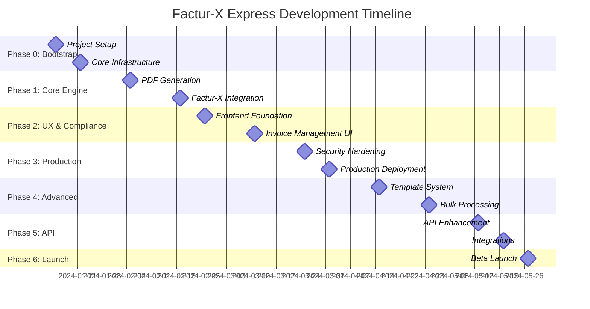

# Project Checkpoints & Milestones

## Overview
This document defines key project milestones, deliverables, and success criteria for the Factur-X Express development lifecycle.

---

## Phase 0: Bootstrap & Foundation
**Duration:** 2 weeks  
**Start Date:** Week 1  
**End Date:** Week 2  

### Checkpoint 0.1: Project Setup (Week 1)
**Deliverables:**
- [ ] Repository structure and monorepo setup
- [ ] Development environment configuration
- [ ] CI/CD pipeline foundation (GitHub Actions)
- [ ] Docker containerization setup
- [ ] Database schema design and migrations
- [ ] Basic FastAPI application structure

**Success Criteria:**
- ✅ All developers can run the project locally
- ✅ CI/CD pipeline runs successfully
- ✅ Database migrations work correctly
- ✅ Docker containers build and run
- ✅ Basic health check endpoint responds

**Exit Criteria:**
- [ ] `make dev-setup` command works on all platforms
- [ ] All tests pass in CI/CD
- [ ] Code quality gates are configured
- [ ] Security scanning is enabled

**Risks & Mitigations:**
- **Risk:** Docker setup complexity on different platforms
- **Mitigation:** Provide platform-specific documentation
- **Risk:** Database migration conflicts
- **Mitigation:** Use Alembic with proper versioning

---

### Checkpoint 0.2: Core Infrastructure (Week 2)
**Deliverables:**
- [ ] Authentication system (JWT + refresh tokens)
- [ ] User registration and login APIs
- [ ] Database models for users and invoices
- [ ] Basic error handling and logging
- [ ] API documentation with OpenAPI
- [ ] Rate limiting implementation

**Success Criteria:**
- ✅ Users can register and authenticate
- ✅ JWT tokens work correctly with refresh
- ✅ API documentation is auto-generated
- ✅ Rate limiting prevents abuse
- ✅ Structured logging is implemented

**Exit Criteria:**
- [ ] Authentication flow works end-to-end
- [ ] API documentation is complete
- [ ] Security headers are configured
- [ ] Monitoring and alerting are set up

---

## Phase 1: Factur-X Core Engine
**Duration:** 4 weeks  
**Start Date:** Week 3  
**End Date:** Week 6  

### Checkpoint 1.1: PDF Generation (Week 3-4)
**Deliverables:**
- [ ] WeasyPrint integration for PDF generation
- [ ] PDF/A-3 compliance validation
- [ ] Basic invoice template system
- [ ] Invoice data model and validation
- [ ] File storage integration (S3)
- [ ] PDF generation API endpoints

**Success Criteria:**
- ✅ Generate PDF/A-3 compliant invoices
- ✅ Basic template renders correctly
- ✅ Files are stored securely in S3
- ✅ PDF generation completes under 3 seconds
- ✅ Memory usage is optimized

**Exit Criteria:**
- [ ] veraPDF validation passes 100%
- [ ] Performance benchmarks are met
- [ ] Error handling covers edge cases
- [ ] Unit test coverage > 90%

**Demo Requirements:**
- Generate a simple invoice PDF
- Validate PDF/A-3 compliance
- Show file storage and retrieval

---

### Checkpoint 1.2: Factur-X XML Integration (Week 5-6)
**Deliverables:**
- [ ] factur-x library integration
- [ ] EN 16931 XML generation
- [ ] XML embedding in PDF/A-3
- [ ] Mustangproject validation integration
- [ ] Complete Factur-X invoice generation
- [ ] Validation reporting system

**Success Criteria:**
- ✅ Generate EN 16931 compliant XML
- ✅ Successfully embed XML in PDF
- ✅ Mustangproject validation passes
- ✅ Dual validation (veraPDF + Mustangproject)
- ✅ Comprehensive validation reports

**Exit Criteria:**
- [ ] 100% EN 16931 compliance validation
- [ ] XML structure matches specification
- [ ] Embedded XML is extractable
- [ ] Validation errors are actionable

**Demo Requirements:**
- Generate complete Factur-X invoice
- Extract and validate embedded XML
- Show validation reports

---

## Phase 2: User Experience & Compliance
**Duration:** 3 weeks  
**Start Date:** Week 7  
**End Date:** Week 9  

### Checkpoint 2.1: Frontend Foundation (Week 7)
**Deliverables:**
- [ ] React application setup with TypeScript
- [ ] Tailwind CSS configuration
- [ ] Authentication UI (login/register)
- [ ] Dashboard layout and navigation
- [ ] Invoice creation form
- [ ] Responsive design implementation

**Success Criteria:**
- ✅ Clean, professional UI design
- ✅ Mobile-responsive layout
- ✅ Authentication flow works
- ✅ Form validation is comprehensive
- ✅ Loading states and error handling

**Exit Criteria:**
- [ ] UI/UX review approval
- [ ] Accessibility standards met (WCAG 2.1)
- [ ] Cross-browser compatibility
- [ ] Performance metrics acceptable

---

### Checkpoint 2.2: Invoice Management UI (Week 8-9)
**Deliverables:**
- [ ] Invoice creation wizard
- [ ] Invoice preview and editing
- [ ] Invoice list and search
- [ ] PDF download and sharing
- [ ] Validation status display
- [ ] Error handling and user feedback

**Success Criteria:**
- ✅ Intuitive invoice creation flow
- ✅ Real-time preview functionality
- ✅ Efficient invoice management
- ✅ Clear validation feedback
- ✅ Smooth user experience

**Exit Criteria:**
- [ ] User acceptance testing passes
- [ ] Performance requirements met
- [ ] Error scenarios handled gracefully
- [ ] Documentation is complete

**Demo Requirements:**
- Complete invoice creation workflow
- Show invoice management features
- Demonstrate validation feedback

---

## Phase 3: Production Readiness & Security
**Duration:** 3 weeks  
**Start Date:** Week 10  
**End Date:** Week 12  

### Checkpoint 3.1: Security Hardening (Week 10-11)
**Deliverables:**
- [ ] Security audit and penetration testing
- [ ] HTTPS/TLS configuration
- [ ] Input validation and sanitization
- [ ] SQL injection prevention
- [ ] CSRF protection implementation
- [ ] Security headers configuration

**Success Criteria:**
- ✅ Zero critical security vulnerabilities
- ✅ OWASP Top 10 compliance
- ✅ Security scan passes
- ✅ Penetration test results acceptable
- ✅ Security documentation complete

**Exit Criteria:**
- [ ] External security audit approval
- [ ] Vulnerability scan clean
- [ ] Security policies documented
- [ ] Incident response plan ready

---

### Checkpoint 3.2: Production Deployment (Week 12)
**Deliverables:**
- [ ] Production environment setup
- [ ] Database migration and seeding
- [ ] Monitoring and alerting configuration
- [ ] Backup and disaster recovery
- [ ] Performance optimization
- [ ] Load testing and capacity planning

**Success Criteria:**
- ✅ Production environment stable
- ✅ Monitoring dashboards functional
- ✅ Backup procedures tested
- ✅ Performance benchmarks met
- ✅ Disaster recovery plan validated

**Exit Criteria:**
- [ ] Production readiness checklist complete
- [ ] SLA requirements met
- [ ] Runbook documentation ready
- [ ] On-call procedures established

---

## Phase 4: Advanced Features
**Duration:** 4 weeks  
**Start Date:** Week 13  
**End Date:** Week 16  

### Checkpoint 4.1: Template System (Week 13-14)
**Deliverables:**
- [ ] Custom template editor
- [ ] Template preview system
- [ ] Logo and branding upload
- [ ] Color scheme customization
- [ ] Template marketplace foundation
- [ ] Template versioning system

**Success Criteria:**
- ✅ Users can create custom templates
- ✅ Template preview is accurate
- ✅ Branding elements work correctly
- ✅ Template performance is optimized
- ✅ Version control is functional

---

### Checkpoint 4.2: Bulk Processing (Week 15-16)
**Deliverables:**
- [ ] CSV/Excel import functionality
- [ ] Batch processing system
- [ ] Progress tracking and notifications
- [ ] Bulk download (ZIP archives)
- [ ] Error reporting and retry logic
- [ ] Email delivery system

**Success Criteria:**
- ✅ Handle large file imports efficiently
- ✅ Process batches without timeouts
- ✅ Provide clear progress feedback
- ✅ Handle errors gracefully
- ✅ Email delivery is reliable

---

## Phase 5: API & Integrations
**Duration:** 3 weeks  
**Start Date:** Week 17  
**End Date:** Week 19  

### Checkpoint 5.1: API Enhancement (Week 17-18)
**Deliverables:**
- [ ] Comprehensive API documentation
- [ ] SDK development (Python, JavaScript)
- [ ] Webhook system implementation
- [ ] API versioning strategy
- [ ] Developer portal
- [ ] API analytics and monitoring

**Success Criteria:**
- ✅ API documentation is comprehensive
- ✅ SDKs work correctly
- ✅ Webhooks are reliable
- ✅ API performance is optimized
- ✅ Developer experience is excellent

---

### Checkpoint 5.2: Third-party Integrations (Week 19)
**Deliverables:**
- [ ] Stripe integration for payments
- [ ] Shopify app development
- [ ] Zapier integration
- [ ] Accounting software connectors
- [ ] OAuth2 provider setup
- [ ] Integration testing suite

**Success Criteria:**
- ✅ Payment processing works smoothly
- ✅ E-commerce integrations function
- ✅ Automation tools connect properly
- ✅ Data synchronization is accurate
- ✅ OAuth flows are secure

---

## Phase 6: Beta Launch Preparation
**Duration:** 2 weeks  
**Start Date:** Week 20  
**End Date:** Week 21  

### Checkpoint 6.1: Beta Launch (Week 20-21)
**Deliverables:**
- [ ] Beta user onboarding system
- [ ] Feedback collection mechanism
- [ ] Analytics and usage tracking
- [ ] Customer support system
- [ ] Documentation and help center
- [ ] Marketing website

**Success Criteria:**
- ✅ Beta users can onboard smoothly
- ✅ Feedback is collected systematically
- ✅ Usage analytics provide insights
- ✅ Support system handles inquiries
- ✅ Documentation is comprehensive

**Exit Criteria:**
- [ ] 100+ beta users onboarded
- [ ] NPS score > 50
- [ ] Critical bugs < 5
- [ ] Performance SLAs met
- [ ] Support response time < 4 hours

---

## Milestone Dependencies

## Risk Management

### High-Risk Checkpoints
1. **Checkpoint 1.2 (Factur-X XML)**: Complex compliance requirements
2. **Checkpoint 3.1 (Security)**: External audit dependencies
3. **Checkpoint 3.2 (Production)**: Infrastructure complexity

### Mitigation Strategies
- **Early validation**: Test compliance early and often
- **External expertise**: Engage security consultants
- **Parallel development**: Work on infrastructure alongside features
- **Buffer time**: Add 20% buffer to critical path items

## Success Metrics

### Technical Metrics
- **Code Coverage**: > 90% for critical components
- **Performance**: < 3s invoice generation
- **Availability**: > 99.9% uptime
- **Security**: Zero critical vulnerabilities

### Business Metrics
- **User Adoption**: 100+ beta users by launch
- **Invoice Generation**: 1000+ invoices in first month
- **Compliance Rate**: 100% validation success
- **User Satisfaction**: NPS > 50

## Checkpoint Review Process

### Weekly Reviews
- **Participants**: Product Manager, Tech Lead, QA Lead
- **Format**: 30-minute checkpoint review
- **Deliverables**: Status update, risk assessment, next steps

### Phase Gate Reviews
- **Participants**: Full team + stakeholders
- **Format**: 2-hour comprehensive review
- **Deliverables**: Go/no-go decision, lessons learned

### Escalation Criteria
- **Red**: Checkpoint delayed > 1 week
- **Amber**: Risk of delay identified
- **Green**: On track for delivery

---

**Document Owner:** Project Management Office  
**Last Updated:** $(date)  
**Next Review:** Weekly during active development  
**Stakeholders:** CEO, CTO, Product Manager, Tech Lead, QA Lead